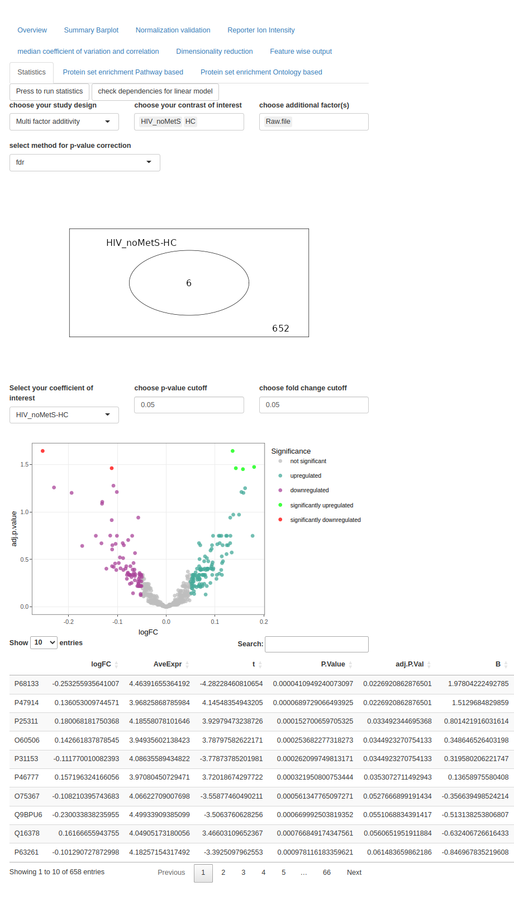

```{r setup, include=FALSE}
#designed with help of: 
#https://ourcodingclub.github.io/tutorials/rmarkdown-dissertation/

knitr::opts_chunk$set(echo = TRUE)
options(tinytex.verbose = TRUE)

#install dependencies
if (!requireNamespace("tinytex", quietly=TRUE))
  install.packages("tinytex")

library(tinytex)

#install dependencies
if (!requireNamespace("DiagrammeR", quietly=TRUE))
  install.packages("DiagrammeR")

library(DiagrammeR)
```

```{r header, echo=F, out.width="100%"}

```

\allsectionsfont{\centering}
\subsectionfont{\raggedright}
\subsubsectionfont{\raggedright}

\pagenumbering{gobble}

\begin{centering}

\Large
\doublespacing
{\bf Design and implementation of an analysis pipeline for single cell proteomics data} 
\\ presenting ProteoScanR \& Proteomics Workbench

\vspace{1 cm}

\normalsize
\singlespacing

\vspace{0.5 cm}

\Large

```{r author_foto, echo=F}

```

{\bf Lukas Gamp}
\vspace{3 cm}

Main supervisor: Dr. DI(FH) Gerhard Duernberger \\
External supervisor: Assoc. Prof. Ujjwal Neogi, M.Sc. Ph.D. \\
Second examiner: FH-Prof. Dr. Alexandra Graf \\
Second external supervisor: Anoop Ambikan, M.Sc. Ph.D. \\

\end{centering}

\newpage
\pagenumbering{arabic}

\begin{centering}

{\bf Abstract}

\end{centering}

\spacing{1.5}

With the growing prominence of single-cell techniques across various omics fields, there is a pressing need to develop a standardized pipeline for proteomics data in the realm of systems biology. Unlike DNA sequencing and RNA sequencing, proteomics analysis via mass spectrometry incurs high costs in terms of labor and equipment. Additionally, commercially available software solutions often come with hefty price tags and limited transparency regarding the underlying methods employed. However, MaxQuant \citep{Cox2008} presents a promising alternative, complemented by the flexibility using the R programming language. 
Introducing ProteoScanR, a state-of-the-art proteomics pipeline integrated into the user-friendly Proteomics Workbench interface. 
Guided by SCoPE2 \citep{Specht2021, Petelski2021, Vanderaa2021}, the development process of ProteoScanR was thoroughly tested and validated using both bulk and single-cell mass spectrometry data sets. The pipeline implementation in the Proteomics Workbench leverages the power of an interactive environment built in R Shiny, empowering users to discover valuable insights for their specific data set. 
Within the interactive environment, users have the flexibility to customize cutoffs and thresholds for quality control, as well as employ various approaches for data transformation, normalization, missing value imputation, and batch correction. 
ProteoScanR and the Proteomics Workbench serves as a valuable tool in guiding the identification of expressed proteins in cells under study. Subsequently, the pathway enrichment analysis provides additional biological contexts for a comprehensive understanding of their functional implications.
The master thesis project serves as a foundation for future advancements in the field of single-cell proteomics. Moreover, the codebase has been designed with robustness and scalability in mind, ensuring ease of maintenance and future expansion of the application.
The source code is accessible and can be located at the following URL: https://github.com/Lukas67/ProteoScanR

\vspace{1 cm}

\begin{centering}
```{r uni_logo, echo=F, out.width="20%", fig.align='center'}

```
This project was performed at the systems virology lab at the Karolinska Institutet in Stockholm.
\end{centering}

\newpage

\begin{centering}

{\bf Introduction}

\end{centering}


The central dogma underpins genetic information's transformation into functional proteins \citep{Cobb2017}. Proteins have various functions, such as providing structural integrity, catalyzing chemical reactions, and regulating cellular functions \citep{Karahalil2016}. Omics fields like genomics, transcriptomics, proteomics, and metabolomics provide an holistic  view of biomolecules. These proteins are comprehensively studied through proteomics to unveil intricate biological networks.

Higher organisms are composed of specialized cells organized into tissues, such as skin, muscle, and blood. Each tissue consists of cells with specific functions, resulting in variations in protein expression. Bulk proteomics is a technique used to analyze the protein composition of a sample, which in case of a tissue contains various cell types. Taking tissue samples can lead to an averaging effect across the entire cellular ensemble, making it difficult to discern specific cell types. To overcome this limitation, cell sorting techniques were employed and enabled targeted single-cell proteomics (SCP) \citep{Liou2015, Sutermaster2019}. Single-cell proteomics reflects the protein ensemble of a specific cell type at a particular time, providing a focused perspective on the studied field compared to bulk methods \citep{Maes2020}.

Mass spectrometry enables qualitative and quantitative analysis of the entire repertoire of a biological sample. Mass spectrometers measure the mass to charge ratio (m/z) of charged particles. Given the high resolution of MS data, algorithms are employed to convert the raw signal into an interpretable form. Software packages like MaxQuant \citep{Cox2008} are commonly used to process the data, providing it for further analysis and statistical testing. 

With advancements in mass spectrometry technology and computational methods, proteomic analysis has emerged as a powerful tool for investigating complex protein samples. However, analyzing proteomic data poses challenges in data processing, statistical analysis, and interpretation. This thesis aims to address these challenges by exploring computational methods for downstream analysis of proteomics data. It is important to acknowledge that downstream analysis in proteomics lacks a standardized approach, and the selection of computational methods depends on the specific dataset and research objectives. ProteoScanR comprises a series of steps to streamline the data in an interactive environment, called Proteomics Workbench. This user-friendly interface will enable researchers, including those with limited computational expertise, to navigate and comprehend the data effectively.

\newpage
\blandscape
\begin{centering}

{\bf Materials and methods}

\end{centering}
\begin{multicols}{3}

```{r data-processing-pipeline-flowchart-vertical, echo=FALSE, fig.height=27, fig.width=17, out.width="75%", fig.align='center', fig.cap= "Flowchart presenting the processing by ProteoScanR. Gold: techniques which involve explanatory data analysis. Yellow: Adjustable features. Blue: Inputs"}
library(Gmisc, quietly = TRUE)
library(glue)
library(htmlTable)
library(grid)
library(magrittr)

default_txt_setting <- gpar(cex=1.9)
default_box_setting <- gpar(fill="white")

data_box_setting <- gpar(fill="#56B4E9")

opts_box_setting <- gpar(fill="lightyellow", col="darkblue")
opts_txt_setting <- gpar(col="darkblue", cex=1.5)
refinement_arrow_setting <- arrow(angle=30, ends="both", type = "closed")

plot_box_setting <- gpar(fill="#DDCC77")
# input files
evidence_file <- boxGrob("evidence file",
                         box_gp = data_box_setting,
                         txt_gp = default_txt_setting)
sample_annotation_file <- boxGrob("sample annotation",
                                  box_gp = data_box_setting,
                                  txt_gp = default_txt_setting)

read_data <- boxGrob(glue("read data into q-feature object",.sep = "\n"),
                     box_gp = default_box_setting,
                     txt_gp = default_txt_setting)

quality_control_1 <- boxGrob(glue("quality control 1",.sep = "\n"),
                             box_gp = default_box_setting,
                             txt_gp = default_txt_setting)

qc1_content <- boxGrob("filter out pool samples\nreplace zeros with NA\nfilter out contaminants\nfilter by q-value cutoff",
                      box_gp = opts_box_setting,
                      txt_gp = opts_txt_setting,
                      just="center")

aggregate_psms <-  boxGrob(glue("aggregate peptide spectrum matches to peptides\n
                                 join multiple batches", .sep = "\n"),
                           box_gp = default_box_setting,
                           txt_gp = default_txt_setting)

quality_control_2 <- boxGrob("quality control 2",
                             box_gp = plot_box_setting,
                             txt_gp = default_txt_setting)

qc2_content <- boxGrob("filter by:\nreporter ion intensity cutoff\npepitde coefficient of variation to razor proteins\npeptide missing rate",
                       box_gp = opts_box_setting,
                       txt_gp = opts_txt_setting,
                       just="center")

aggregate_peps <- boxGrob(glue("aggregate peptides to proteins", .sep = "\n"),
                          box_gp = default_box_setting,
                          txt_gp = default_txt_setting)

transform_data <- boxGrob("transform data",
                          box_gp = plot_box_setting,
                          txt_gp = default_txt_setting)

transform_opts <- boxGrob("options:\nlog2\nlog10\nsqrt\nquadratic\nBoxCox\nNone",
                          box_gp = opts_box_setting,
                          txt_gp = opts_txt_setting,
                          just="center")

normalize_data <- boxGrob("normalize data",
                          box_gp = plot_box_setting,
                          txt_gp = default_txt_setting)

normalize_opts <- boxGrob("options:\ncol-Median,row_Mean\nCONSTANd\nNone",
                          box_gp = opts_box_setting,
                          txt_gp = opts_txt_setting,
                          just="center")

missing_value_handling <- boxGrob("missing value handling",
                                  box_gp = plot_box_setting,
                                  txt_gp = default_txt_setting)

missing_value_opts <- boxGrob("options:\nKNN\ndrop rows\nreplace with mean\nreplace with median\nreplace with 0",
                              box_gp = opts_box_setting,
                              txt_gp = opts_txt_setting,
                              just="center")

batch_correction <- boxGrob("batch correction & dimensionality reduction",
                            box_gp=plot_box_setting,
                            txt_gp = default_txt_setting)

batch_correction_opts <- boxGrob("ComBat\nPCA\nUMAP",
                                 box_gp = opts_box_setting,
                                 txt_gp = opts_txt_setting,
                                 just="center")

dim_red <- boxGrob("dimensionality reduction",
                   box_gp = plot_box_setting,
                   txt_gp = default_txt_setting)

dim_red_actions <- boxGrob("procedures:\nPCA\nUMAP",
                       box_gp = opts_box_setting,
                       txt_gp = opts_txt_setting,
                       just="center"
                       )

stat_module <- boxGrob(glue("differential expression\npathway enrichment\nontology enrichment",.sep = "\n"),
                       box_gp = default_box_setting,
                       txt_gp = default_txt_setting)

grid.newpage()
vert <- {spreadVertical(files = evidence_file,
                       read_data = read_data,
                       quality_control_1 = quality_control_1,
                       aggregate_psms,
                       quality_control_2 = quality_control_2,
                       aggregate_peps,
                       transform_data = transform_data,
                       normalize_data = normalize_data,
                       missing_value_handling = missing_value_handling,
#                       batch_correction = batch_correction,
#                       dim_red = dim_red,
                       out = stat_module
)}
input <- alignVertical(reference = vert$files,
                      evidence_file, sample_annotation_file) %>%
  spreadHorizontal()
vert$files <- NULL

output <- alignVertical(reference = vert$out,
                      stat_module, batch_correction) %>%
  spreadHorizontal()
vert$out <- NULL


# right side
qc1_content <- moveBox(qc1_content,
                    x = .8,
                    y = coords(vert$quality_control_1)$y)

transform_opts <- moveBox(transform_opts,
                    x = .9,
                    y = coords(vert$transform_data)$y)


# dim_red <- moveBox(dim_red,
#                    x = coords(output[[2]])$x,
#                    y = 0)

batch_correction_opts <- moveBox(batch_correction_opts,
                    x = coords(output[[2]])$x,
                    y = coords(vert$missing_value_handling)$y)

# dim_red_actions <- moveBox(dim_red_actions,
#                     x = (coords(dim_red)$x -.5),
#                     y = coords(dim_red)$x)

# left side
qc2_content <- moveBox(qc2_content,
                    x = .17,
                    y = coords(vert$quality_control_2)$y)

normalize_opts <- moveBox(normalize_opts,
                    x = .2,
                    y = coords(vert$normalize_data)$y)

missing_value_opts <- moveBox(missing_value_opts,
                    x = .2,
                    y = coords(vert$missing_value_handling)$y)


for (i in 1:(length(vert) - 1)) {
  connectGrob(vert[[i]], vert[[i + 1]], type = "vert") %>%
    print
}

# connect boxes
connectGrob(input[[1]], vert$read_data, type = "N")
connectGrob(input[[2]], vert$read_data, type = "N")

connectGrob(vert$quality_control_1, qc1_content, type = "horizontal", arrow_obj = arrow(angle=0))

connectGrob(vert$quality_control_2, qc2_content, type = "horizontal", arrow_obj = refinement_arrow_setting)

connectGrob(vert$transform_data, transform_opts, type = "horizontal", arrow_obj = refinement_arrow_setting)

connectGrob(vert$normalize_data, normalize_opts, type = "horizontal", arrow_obj = refinement_arrow_setting)

connectGrob(vert$missing_value_handling, missing_value_opts, type = "horizontal", arrow_obj = refinement_arrow_setting)

connectGrob(vert$missing_value_handling, output[[1]], type = "N")
connectGrob(vert$missing_value_handling, output[[2]], type = "N")

connectGrob(output[[2]], batch_correction_opts, type = "N", arrow_obj = arrow(angle=0), subelmnt = "r")

# connectGrob(vert$dim_red, dim_red_actions, type = "horizontal", arrow_obj = arrow(angle=0))

# Print boxes
input
vert
qc1_content
qc2_content
transform_opts
normalize_opts
missing_value_opts
batch_correction_opts
output
# dim_red
# dim_red_actions
```


The flowchart describes the processes involved in the ProteoScanR pipeline. 
ProteoScanR initially filters the data by false discovery rate (FDR) converted to q-value (provided by MaxQuant \citep{Cox2011}), according to precursor ion fraction (PIF) \citep{Tannous2020, Specht2021} and subsequently aggregates peptide spectrum matches to peptides. 

The quality control continues with calculating median reporter ion intensity (RI), median coefficient of variation (CV) and filtering according to cutoffs. Subsequently peptides with high missing rate are removed and peptides are aggregated to proteins. 

Preparation for hypothesis testing involves data transformation and normalization. Missing values for proteins in individual channels are handled according to user selection with methods such as the K-nearest neighbor algorithm (=KNN) \citep{Lan2013}. Before statistical analysis, dimensionality reduction techniques were applied and observed with and without correcting for batch effect by ComBat \citep{Johnson2007}. Furthermore data processing is validated with an entropy based approach for the conservation of information. 

Statistical testing involves differential expression analysis with the R package Limma \citep{Phipson2016}. Hypothesizes can be selected by the user and p-value correction can be employed with different approaches to meet conservative as well as liberal study designs. 

After finding differentially expressed proteins, enrichment elucidates them in biological context by finding over represented proteins. The protein enrichment analysis is employed in selected contexts such as pathways, cell-types or custom ontologies. The pathway enrichment analysis is performed using the R Bioconductor package clusterProfiler \citep{Wu2021}. The analysis utilizes the entire “Kyoto Encyclopedia of Genes and Genomes” (KEGG) database, which is accessed through a function that maps the UniProt IDs to corresponding pathways. For custom ontologies the protein enrichment analysis undertaken with the R bioconductor package piano \citep{Vaeremo2013}. In opposite to the pathway enrichment, piano maps proteins to a pre-selected gene collection set, which is either downloaded from gsea-msigdb.org or custom made for the particular experiment and explains conditions, phenotype or other desired properties. 

\end{multicols}
\elandscape

\newpage
\begin{centering}

{\bf Results}

\end{centering}

```{r ui-numbers-default, echo=F, out.width="100%", fig.align='center', fig.cap="Screenshot of proteomics workbench. Summary barplot showing the number of peptide spectrum matches, peptides and proteins"}
knitr::include_graphics("screenshots/numbers_default.png")
```

The ProteoScanR pipeline is employed in the proteomics workbench. Users find settings for the pre-processing on the left hand side of the interface (see figure \@ref(fig:ui-numbers-default)). The main panel shows the data in different aspects and helps the user finding a good fit for the methods applied to their individual dataset. 

Beforehand normalization was tested with applying logarithmic transformation to the base 2 and performing column median row mean normalization (not shown in figure). The mutual information (MI) within the healthy control (HC) group's sample type exhibited a reduction towards the lower edge of the interquartile range (IQR).

After performing a logarithmic transformation to the base 2 and quantile normalization, the mutual information (MI) within the healthy control (HC) group's sample type exhibits a minor reduction in the interquartile range (IQR). However, it should be noted that there is an increase in the number of outliers compared to the raw data.
When switching to the quantile normalization the loss of mutual information between sample types decreased. Therefore the advised normalization technique for this particular data set would be the quantile normalization compared to the default method \citep{Specht2021}. 

\blandscape
\begin{multicols}{2}

```{r ui-stat-HC-HIV-noMets, echo=F, out.width="80%", fig.align='center', fig.cap="Screenshot of statistics module in portrait mode"}

```

By comparing the log10-transformed and quantile-normalized expression values between the HIV group without metabolic syndrome and the healthy control (HC) group, six differentially expressed proteins were identified. The Venn diagram indicates significantly up/down regulated proteins. The Volcano represents -log10(adjusted p values) against log2 fold changes (logFC).

\begin{centering}

{\bf Discussion and conclusion}

\end{centering}

The Proteomics Workbench interface and the ProteoScanR pipeline demonstrates how interactive engagement with the data not only enhances the experience of biologists but also improves the comprehension of the underlying significance of a biological dataset. By utilizing an entropy-based visualization approach, the conservation of information can be validated, allowing users to select appropriate methods and adjust thresholds, cutoffs, and techniques accordingly. With the selection of factors to indicate over multiple plots, biases can be identified on various levels. Additionally, the analysis can be examined on an individual protein basis, enabling the identification of suspicious results and closer validation of significant candidates. The statistics module provides users with a simple tool to assess and visualize the results, offering clarity to dense scatter plots through hover functions. Enrichment mapping links statistically significant proteins to either the KEGG pathway database or individual research data sets, depending on user selection. These final results place the data in a biological context, which can be explored interactively in graphical visualizations.


\end{multicols}
\elandscape

\newpage
```{r biblio, child = 'bibliography.Rmd'}
```


