# Results

To begin using the application, the first step is to upload the tab-delimited evidence file and the sample annotation file after processing the data with MaxQuant. Once these files are uploaded, the application is ready to run with default values. The default settings are preconfigured for an initial analysis, and any further adjustments or fine-tuning can be made in subsequent steps of the analysis process.

## Pre-processing and quality control
The initial stages of the pipeline are focused on creating a reliable dataset for analysis that is free from noise and bias.

```{r ui-summary, echo=F, out.width="100%", fig.align='center', fig.cap="Summary showing the processing steps of the analysis pipeline"}
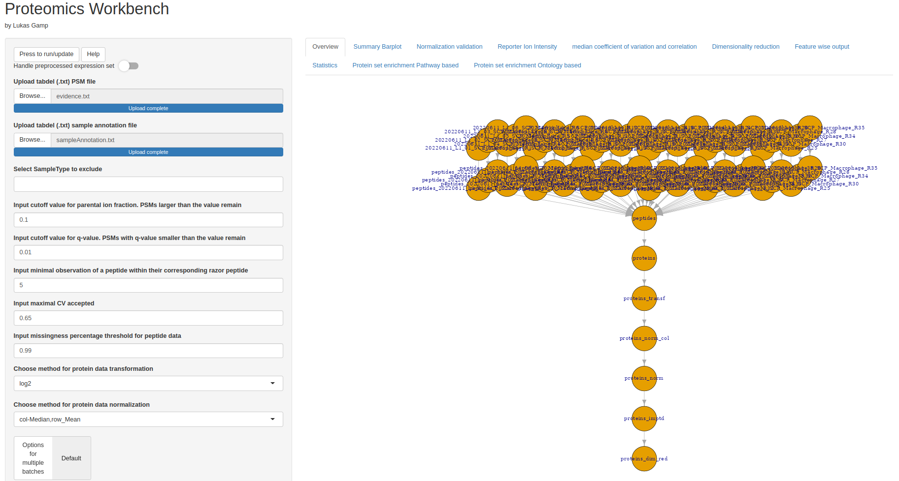
```

After a runtime of 2 minutes on the 4 core laptop the data is ready to visualize. On the left side of the user interface (see figure \@ref(fig:ui-summary)), users can find the analysis pipeline settings that can be adjusted. Once the desired changes are made, they can be applied by clicking the update button. This allows users to observe the direct impact of the applied changes on the dataset.
In the summary visualization, it may appear cluttered due to the processing of 36 files. In smaller data sets, the nodes of the network graph can be more easily distinguished and understood.
When running the application with SCoPE2 \citep{Specht2021} reference cutoffs, the following results were visualized.

\newpage
```{r ui-numbers-default, echo=F, out.width="100%", fig.align='center', fig.cap="Barchart showing the number of peptide spectrum matches, peptides and proteins"}
knitr::include_graphics("screenshots/numbers_default.png")
```
In order to get an idea of the magnitude of the data set, the barplot provides an overview (see figure \@ref(fig:ui-numbers-default)).
The default settings of the analysis pipeline resulted in a total number of unique proteins below approximately 1,000, which were aggregated from around 3,000 peptides. Before these peptides were aggregated over approximately 32,000 peptide spectrum matches. The aggregation for both steps was performed by the column median.

\newpage
```{r ui-mutual-info-default, echo=F, out.width="100%", fig.align='center', fig.cap="Mutual information with default setting"}
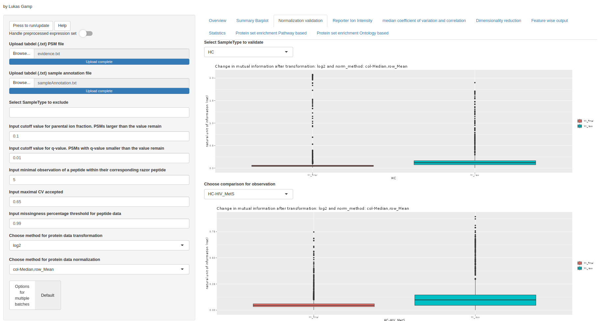
```
One of the first steps of quality control is to assess the loss of information in the observed data set. The entropy based analysis gives insight in impact the computations had on the initial data set. When exploring the intra and inter groupwise comparison as a boxplot (see figure \@ref(fig:ui-mutual-info-default)), the user can elaborate the loss in mutual information.

After applying logarithmic transformation to the base 2 and performing column median row mean normalization, the mutual information (MI) within the healthy control (HC) group's sample type exhibits a reduction towards the lower edge of the interquartile range (IQR).

MI between the HC group and the sample type corresponding to individuals with both HIV and metabolic syndrome, the IQR is further reduced and shifted towards the lower end compared to the MI values observed in the raw data.

Therefore, it is advisable to experiment with various normalization techniques.

\newpage
```{r ui-constand-norm, echo=F, out.width="100%", fig.align='center', fig.cap="Popup showing the dependencies for the CONSTANd normalization"}
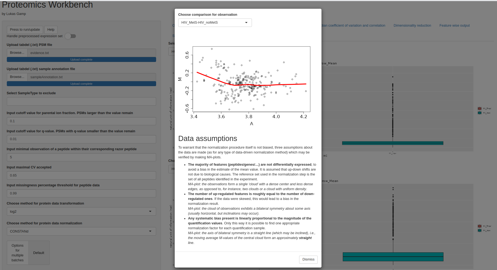
```
Choosing the CONSTANd option for normalization a popup window appears to test for assumptions on the dataset. 

As seen in the dependency popup (see figure \@ref(fig:ui-constand-norm)) for the CONSTANd normalization \citep{VanHoutven2021}, requirements are not fulfilled. The MA-plot shows a strong heteroskedasticity indicated by the red trendline. 

\newpage
```{r ui-mutual-info-quant-norm, echo=F, out.width="100%", fig.align='center', fig.cap="Mutual information with quantile normalization"}
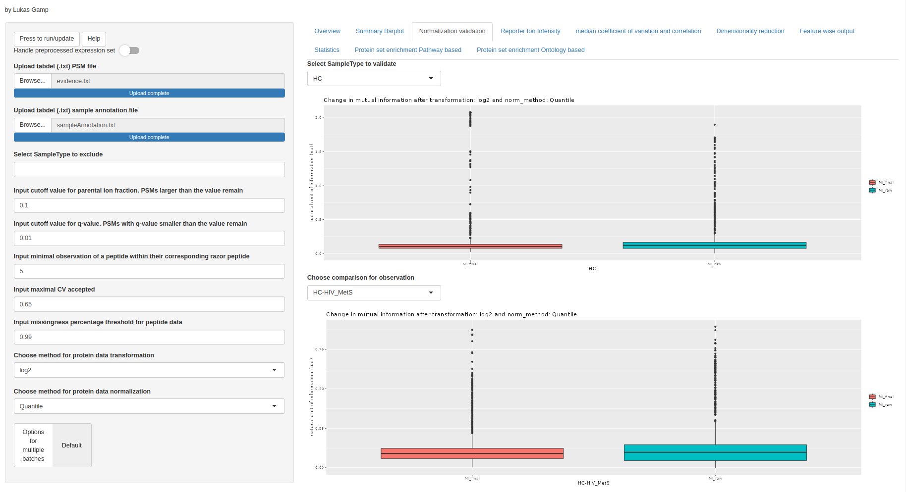
```
When switching to the quantile normalization the loss of mutual information decreased. Therefore the advised normalization technique for this particular dataset would be the quantile normalization (see figure \@ref(fig:ui-mutual-info-quant-norm) compared to figure \@ref(fig:ui-mutual-info-default)). 

After performing a logarithmic transformation to the base 2 and quantile normalization, the mutual information (MI) within the healthy control (HC) group's sample type exhibits a minor reduction in the interquartile range (IQR). However, it should be noted that there is an increase in the number of outliers compared to the raw data.

Observing MI IQR of the HC group with the sample type corresponding to individuals with both HIV and metabolic syndrome, the reduction in MI falls within the interquartile range of the raw data MI. Additionally, the median remains close to unaffected, indicating that the overall central tendency of the MI values is relatively preserved.

\newpage
```{r ui-RI-channel-default, echo=F, out.width="100%", fig.align='center', fig.cap="Reporter ion intensity with selection on channel. The selected factor will be highlighted and indicated in the legend."}
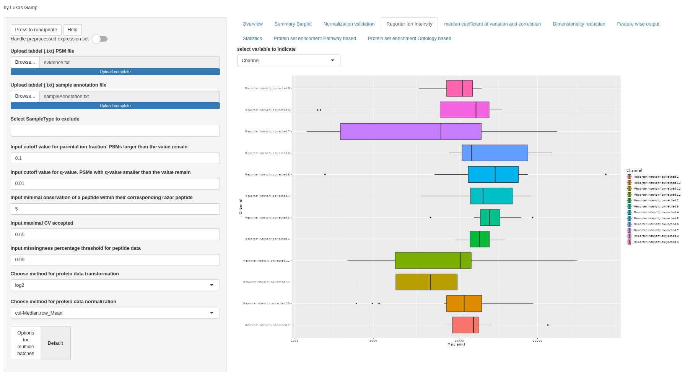
```

In order to check if the TMTpro correction in MaxQuant removed the signal spillage in other channels correctly, it is recommended to compare channel intensity (see figure \@ref(fig:ui-RI-channel-default)).
When comparing the median reporter ion intensities across channels, no systematic bias is observed. However, it is worth noting that channel 7 exhibits a wide range of values spanning an order of magnitude. This comparison is crucial since the three sample types consistently occupy the same channels in every run, making the visualization an important aspect of the analysis. Despite the wide range of values in channel 7, there is still overlap in the interquartile ranges (IQR) across the majority of samples. 

\newpage
```{r ui-RI-file-default, echo=F, out.width="100%", fig.align='center', fig.cap="Reporter ion intensity with selection on file"}
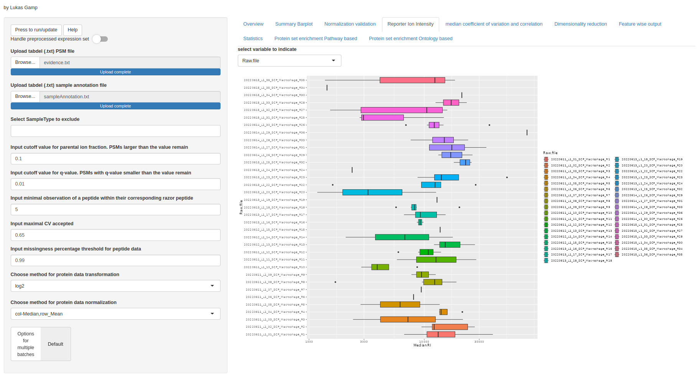
```
The reporter ion intensity highlights also differences on raw files, which is advisable to observe prior to any statistics or dimensionality reduction. 

Comparing the median reporter ion intensities with a focus on the batch (=Raw.file), it becomes evident that there are significant changes in signal that need to be taken into account in further analysis (see figure \@ref(fig:ui-RI-file-default)). After applying quality control measures, several values have been lost due to cutoffs in parameters such as parental ion fraction (PIF), q-value, coefficient of variation, and missingness of peptide data.

For dimensionality reduction, the user has the option to choose the batch correction method ComBat \citep{Leek2012} in the side panel. However, this option is not set as the default choice. Instead, the conservative approach is followed, where the batch factor is included in the statistical module to account for any potential batch effects that may influence the results.

\newpage
```{r ui-RI-st-default, echo=F, out.width="100%", fig.align='center', fig.cap="Reporter ion intensity with selection on sampletype"}
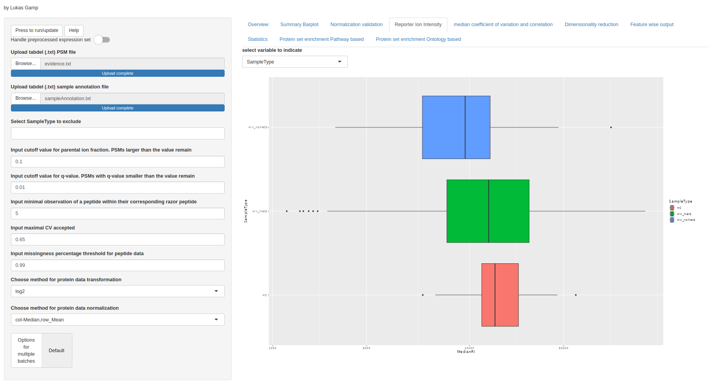
```
Comparing sample types in regards of reporter ion intensity is recommended to observe any experimental bias such as batch/channel confounding effects which would negatively impact the statistical model afterwards.

The sample type does not appear to have an impact on the median reporter ion intensities, as suggested by the overlapping interquartile ranges (IQRs). Nevertheless, the HIV group with metabolic syndrome displays a broader range of values spanning tenfold in arbitrary units (see figure \@ref(fig:ui-RI-st-default)).

\newpage
```{r ui-cv-st-default, echo=F, out.width="100%", fig.align='center', fig.cap="Median covariance of razor proteins with selection on sampletype"}
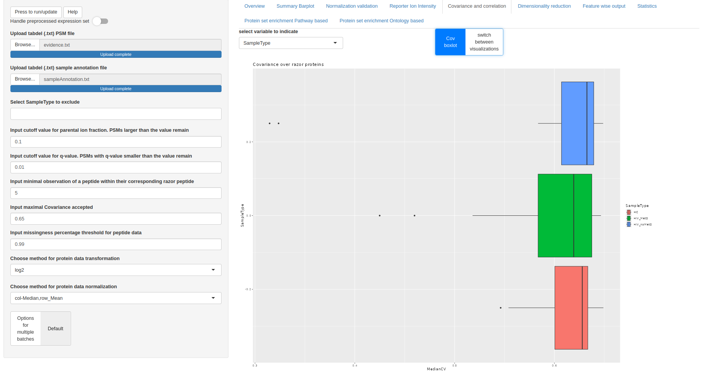
```
The distribution of median coefficient of variation (CV) shows the uniqueness in peptides for their respective razor protein. This metric represents the presence or absence of noisy matches in the data set.

A cutoff value of 0.65 for the coefficient of variation (CV) of razor proteins as shown in the SCoPE2 publication \citep{Specht2021} demonstrates a satisfactory fit to the data. The minimum number of observations determines the threshold for considering a razor protein ambiguous, based on the number of matching peptides. In this case, the recommended minimum number of observation of 5 (by \citep{Specht2021}) was used. 

The interquartile ranges (IQRs) remained unchanged by this cutoff (see figure \@ref(fig:ui-cv-st-default)). The sample type did not influence the CV of razor proteins. Boxplots illustrate that the values are distributed similarly, as indicated by the overlapping IQRs.

\newpage
```{r ui-cv-rawfile-default, echo=F, out.width="100%", fig.align='center', fig.cap="Median coefficient of variation (CV) of leading razor proteins per cell with selection on Raw.file"}
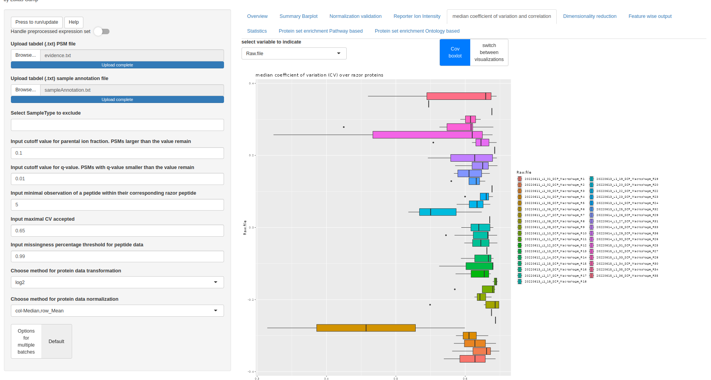
```
Razor peptide ambiguity over multiple batches can indicate experimental failures during sample prep (especially digestion) or during acquisition. 

The plot (see figure \@ref(fig:ui-cv-rawfile-default)) illustrates that certain batches (=raw files) exhibit a higher number of distinct matches compared to others, as indicated by a thin line depicting low density. Most interquartile ranges (IQRs) overlap, suggesting similarity among the majority of batches. However, specific batches display a lower IQR in median CV across razor protein peptides, indicating distinct matches.    

\newpage
```{r ui-cv-rawfile-nobs2, echo=F, out.width="100%", fig.align='center', fig.cap="Median coefficient of variation (CV) of leading razor proteins calculated for 2  observations per cell, grouped by Raw.file"}
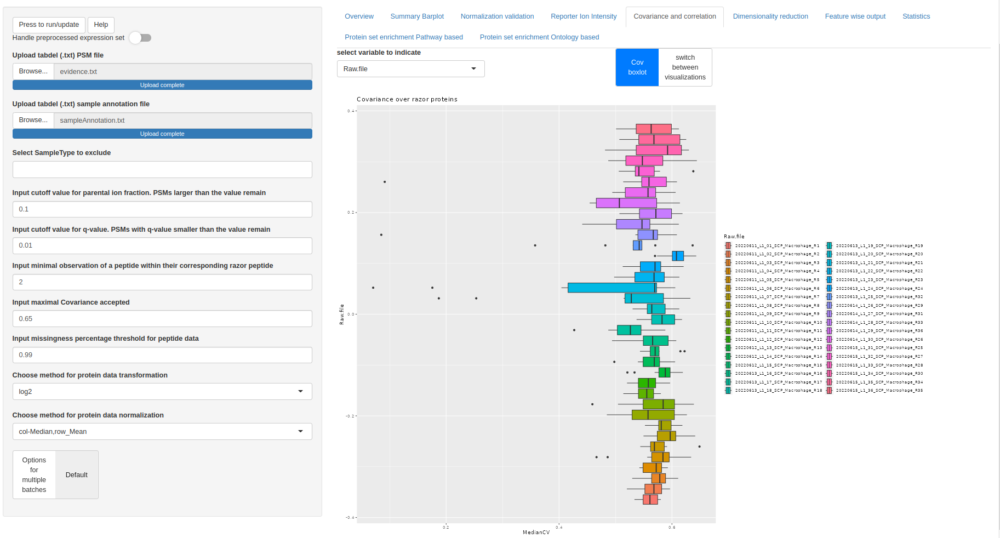
```
Experimenting with a lower minimum number of observations for the calculation of the median coefficient of variation, includes also less ambigous peptides. 

By setting the number of observations to 2, the distributions become more equalized (see figure \@ref(fig:ui-cv-rawfile-nobs2)). Additionally, batches that initially exhibited a decreased coefficient of variation (CV) tend to inflate towards the threshold.

\newpage
```{r ui-cv-rawfile-nobs10, echo=F, out.width="100%", fig.align='center', fig.cap="Median coefficient of variation (CV) of leading razor proteins calculated for 10 observations per cell, with selection on Raw.file"}
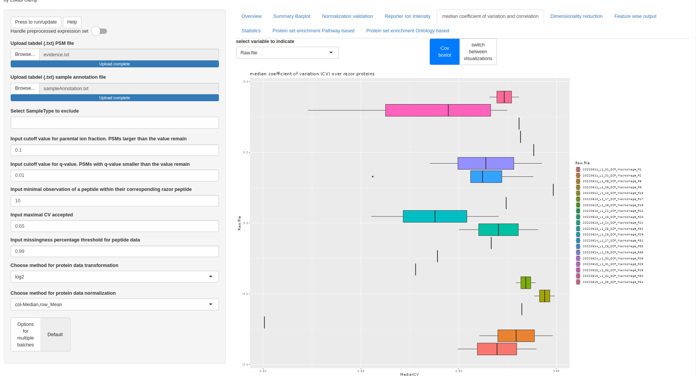
```
In opposite increasing the minimum number of observation takes only highly ambiguous peptides into account and the coefficent of variation shows the interaction of these razor proteins. 

When the minimum number of observations for ambiguous peptides is set to 10, the distribution of medians across channels shows a decrease in density (see figure \@ref(fig:ui-cv-rawfile-nobs10)). This can be attributed to the rare occurrence of 10 unique peptides matching to the same protein, which is rarely observed in the dataset. 

\newpage
## Downstream analysis
The subsequent analysis reveals the initial biological effects, serving as an indicator of the effectiveness or ineffectiveness of the pre-processing and quality control steps.

```{r ui-heatmap, echo=F, out.width="100%", fig.align='center', fig.cap="Correlation heatmap"}
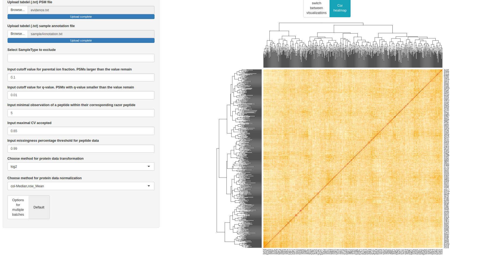
```
The heatmap (see figure \@ref(fig:ui-heatmap)) reveals the Pearson pairwise correlation coefficients between all proteins. The dendrogram indicates that there are two main protein clusters, with one of the clusters showing further sub-clustering, indicating a strong relationship among the proteins in the sub groups. However, the other cluster, consisting of individual proteins, shows weaker correlations, leading to a more intricate branching pattern in the dendrogram.

\newpage
```{r ui-dim-red-default, echo=F, out.width="100%", fig.align='center', fig.cap="Dimensionality reduction analysis depicting sample types (indicated by shape) and raw files (indicated by color). Top: principle component analysis (PCA). Lower: Uniform Manifold Approximation and Projection (UMAP)"}
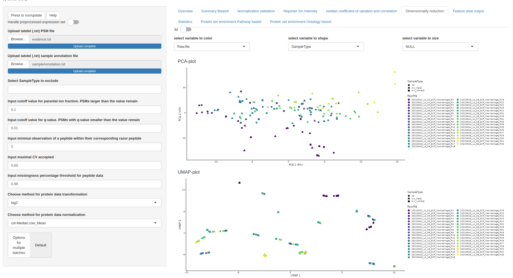
```

In both the Principal Component Analysis (PCA) plot and the Uniform Manifold Approximation and Projection (UMAP) plot (see figure \@ref(fig:ui-dim-red-default)), the second component is plotted against the first component. Surprisingly, neither visualization reveals any discernible clustering patterns based on sample type or batch. For the k-nearest neighbor descent algorithm (NN-descent) employed in the UMAP, first a default value of k=3 was selected.

\newpage
```{r ui-dim-red-changed-k, echo=F, out.width="100%", fig.align='center', fig.cap="Dimensionality reduction analysis showcasing sample types (represented by shape) and raw files (represented by color). Top: Principal Component Analysis (PCA). Bottom: Uniform Manifold Approximation and Projection (UMAP). For the UMAP visualization, the k value for the NN-descent algorithm was modified to 15."}
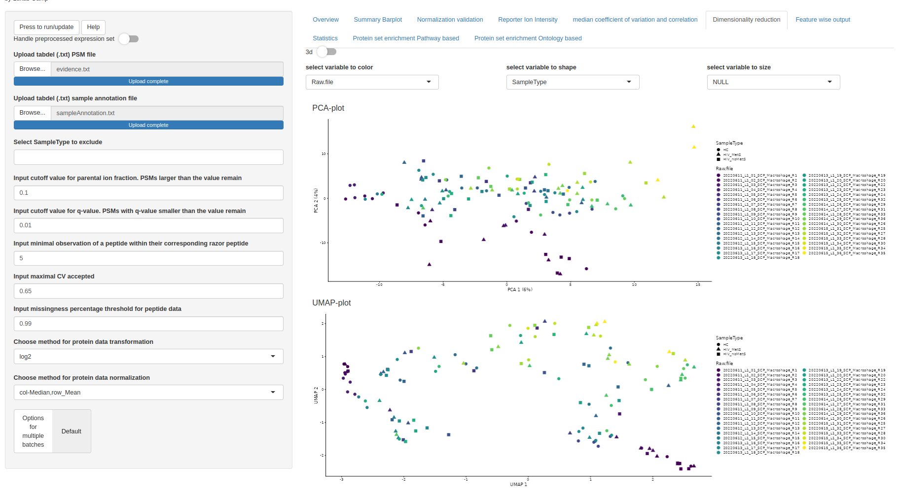
```

The second figure (\@ref(fig:ui-dim-red-changed-k) of the Principal Component Analysis (PCA) plot and the Uniform Manifold Approximation and Projection (UMAP), both displaying the second component against the first. Surprisingly, neither visualization reveals any discernible clustering patterns based on sample type or batch information. To enhance the resolution and capture more intricate patterns, the k-nearest neighbor descent algorithm (NN-descent) was adjusted, with a value of K set to 15. While the resulting plot exhibits improved detail, the underlying biological context or background remains elusive and does not emerge in the visual representation.

\newpage
```{r ui-dim-red-c3d, echo=F, out.width="100%", fig.align='center', fig.cap="3D visualization of dimensionality reduction analysis showcasing sample types (represented by shape) and raw files (represented by color). Top: Principal Component Analysis (PCA). Bottom: Uniform Manifold Approximation and Projection (UMAP)"}
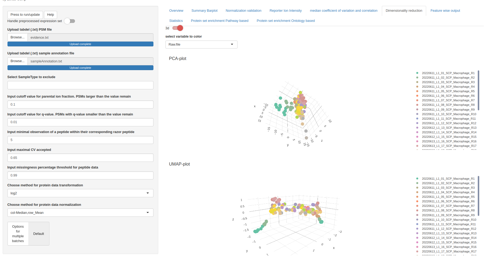
```

In the 3D visualization (see figure \@ref(fig:ui-dim-red-c3d)), a subtle clustering pattern can be observed for the first two batches. Upon switching to the indicator sample type in the 3D visualization, no clustering can be observed whatsoever. This suggests that the variance in the data set is not attributed to sample type or batch, reinforcing the notion that other factors could contribute to the observed variability. 

\newpage
```{r ui-dim-red-batchC, echo=F, out.width="100%", fig.align='center', fig.cap="Batch corrected dimensionality reduction analysis showcasing sample types (represented by shape) and raw files (represented by color)."}
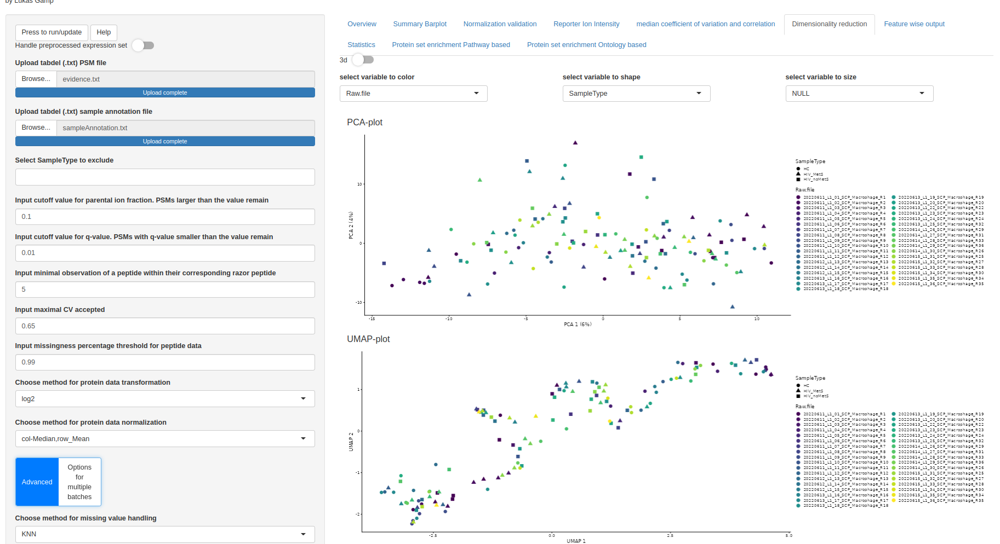
```

```{r ui-dim-red-batchC-3d, echo=F, out.width="100%", fig.align='center', fig.cap="Batch corrected dimensionality reduction analysis showcasing sample types (represented by shape) and raw files (represented by color) in 3D."}
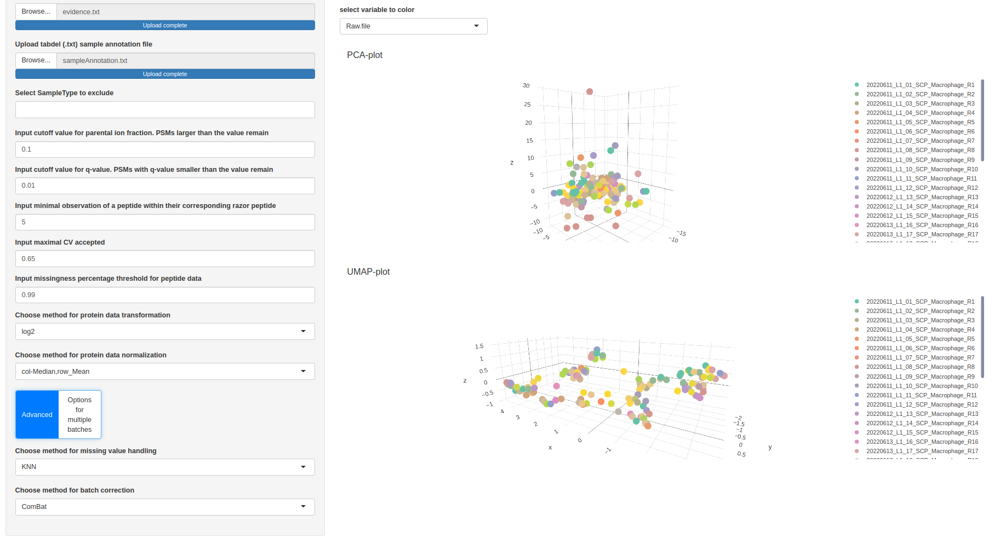
```

After applying batch correction using ComBat \citep{Leek2012}, neither the 2D (figure \@ref(fig:ui-dim-red-batchC)) nor the 3D (figure \@ref(fig:ui-dim-red-batchC-3d)) visualization demonstrates any noticeable effects related to batches or sample types. The previously observed subtle clustering of the first two batches is now eliminated, indicating successful batch correction. However, it's important to note that the default pipeline was executed without batch correction for correct statistical testing. 

\newpage
```{r ui-feature, echo=F, out.width="100%", fig.align='center', fig.cap="Feature wise output for the protein P61313 (=60S ribosomal protein L15) over the course of the pipeline."}
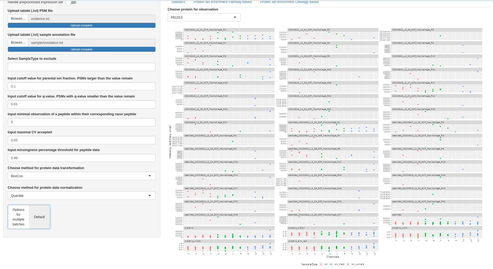
```
The feature-wise output allows for the observation of abundance in raw files or batches, providing a useful tool to assess the effectiveness of pre-processing and/or the work conducted in the wet lab. 

The scatter plots (see figure \@ref(fig:ui-feature)) indicate the detected values associated with the protein UniProt ID P61313 (= 60S ribosomal protein L15). Starting from the peptide spectrum level and progressing to peptides aggregated for individual raw files, these plots offer a comprehensive view of the protein's peptide abundance across various batches. As indicated 14 batches show no abundance of peptides derived from the protein P61313 at all. After merging the batches, the peptides appear to be abundant in all channels. 

\newpage
## Statistics

```{r ui-stat-dependency, echo=F, out.width="100%", fig.align='center', fig.cap="Popup window for checking the dependency of the statistic module"}
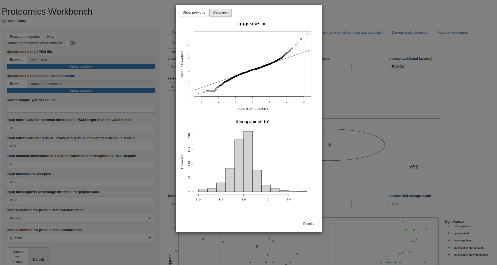
```

The t-statistics employed in limma are known for their robustness in handling non-normally distributed values. Nonetheless, it is recommended for users to assess the distribution of their data based on sample types before proceeding with statistical analysis. If the user is not satisfied with the results or identifies any distributional issues, the user can consider revisiting the transformation or normalization steps to address any concerns or improve the data distribution prior to statistical analysis.

The values for all sample types exhibit a unimodal distribution (see figure \@ref(fig:ui-stat-dependency)). However, when examining the quantile-quantile (qq) plot, heavy tails can be observed for all three groups. This indicates deviations from a perfectly normal distribution, suggesting potential outliers in the data.

\newpage
```{r ui-stat-HC-HIV-noMets, echo=F, out.width="70%", fig.align='center', fig.cap="Statistics module"}
knitr::include_graphics("screenshots/stat_HC_HIV_noMets.png")
```

\newpage

By comparing the log10-transformed and quantile-normalized expression values between the HIV group without metabolic syndrome and the healthy control (HC) group (see figure \@ref(fig:ui-stat-HC-HIV-noMets)), six differentially expressed proteins were identified. The Venn diagram indicates significantly up/down regulated proteins. The Volcano represents -log10(adjusted p values) against log2 fold changes (logFC).
These proteins include P68133 (Actin, alpha skeletal muscle), P47914 (60S ribosomal protein L29), P25311 (Zinc-alpha-2-glycoprotein), O60506 (Heterogeneous nuclear ribonucleoprotein Q), P31153 (S-adenosylmethionine synthase isoform type-2), and P46777 (60S ribosomal protein L5). The remaining 652 proteins have been identified as not significantly up/down regulated in the comparison analysis. These proteins did not exhibit statistically significant differences in expression between the compared groups or conditions.

The direction of the contrast model determines the change in log-fold change (logFC) values. For instance, in the depicted figure, P68133 (Actin, alpha skeletal muscle) shows an increased expression of 0.25 (25%) in HIV_noMetS macrophages compared to HC macrophages. It's important to note that the logFC value changes by multiplication with -1 when the direction of the contrast model is reversed.

To account for potential batch effects, the batch factor was included as a cofactor in the model, ensuring that any observed differential expression is not confounded by batch variation.

\newpage
```{r ui-path-enrich-nw, echo=F, out.width="90%", fig.align='center', fig.cap="Pathway enrichment. Networkplot indicating the association of differentially expressed proteins with pathways"}
knitr::include_graphics("screenshots/path_enrich_nw.png")
```
The enrichment represents overabundant proteins for specific pathways. Results can be shown as a network or barplot. 

The pathway enrichment mapped and tested with the exact Fisher test \citep{Sprent2011} the differentially expressed proteins P46777 (60S ribosomal protein L5) and P47914 (60S ribosomal protein L29) to the ribosome and coronavirus disease (COVID-19) nodes (see figure \@ref(fig:ui-path-enrich-nw)). 

\newpage
```{r ui-path-enrich-bar, echo=F, out.width="90%", fig.align='center', fig.cap="Pathway enrichment. Barplot indicating the number of differentially expressed proteins to a particular pathwaz. The color highlights the significance of the mapping, with exact p-values from the Fisher test after false discovery rate correction."}
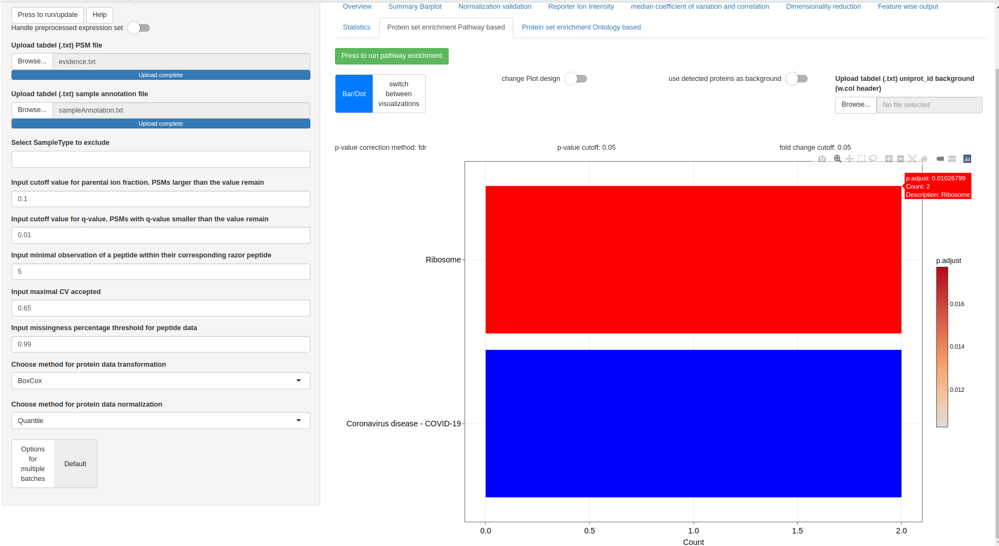
```

The barplot (see figure \@ref(fig:ui-path-enrich-bar)) shows the significance of the two nodes. The count indicates how many proteins are associated with the node of the network. When hovering over the bar the user can read the p-value of the performed Fisher test. The background for the statistical test can be chosen as genome wide (default) or as the set of detected proteins. When choosing the detected proteins as a background no pathway could be considered as statistically significant. 

\newpage
```{r ui-go-enrich-bar, echo=F, out.width="90%", fig.align='center', fig.cap="Protein ontology enrichment against the complete human proteome. Snapshot dotplot indicating the interaction significance of found proteins"}
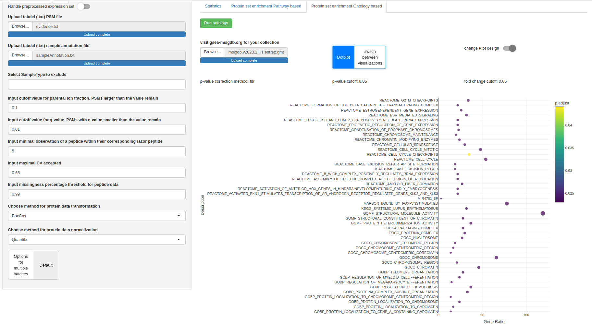
```
Ontology enrichment offers a more comprehensive mapping, providing a broader understanding of the data. By allowing users to select a custom protein set collection, they can either narrow down the potential results for a targeted approach or expand their scope for an untargeted analysis.

The position of the dot (see figure \@ref(fig:ui-go-enrich-bar)) shows the number of matches for the particular protein set. Colors indicate for the significance level. In this analysis the entire repertoire of detected proteins was used and fetched against the bundle containing all Human gene sets in the Human Molecular Signatures Database (MSigDB). After a runtime of 3 minutes 672 of 24667 gene sets were found significantly over represented. Only the protein set collections with the most protein matches were used (snipping tool Plotly).
