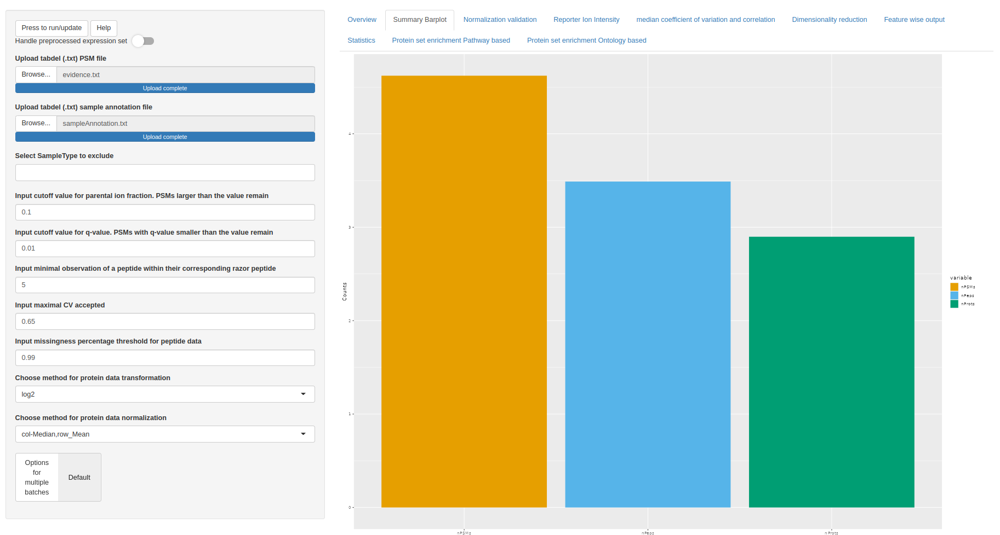
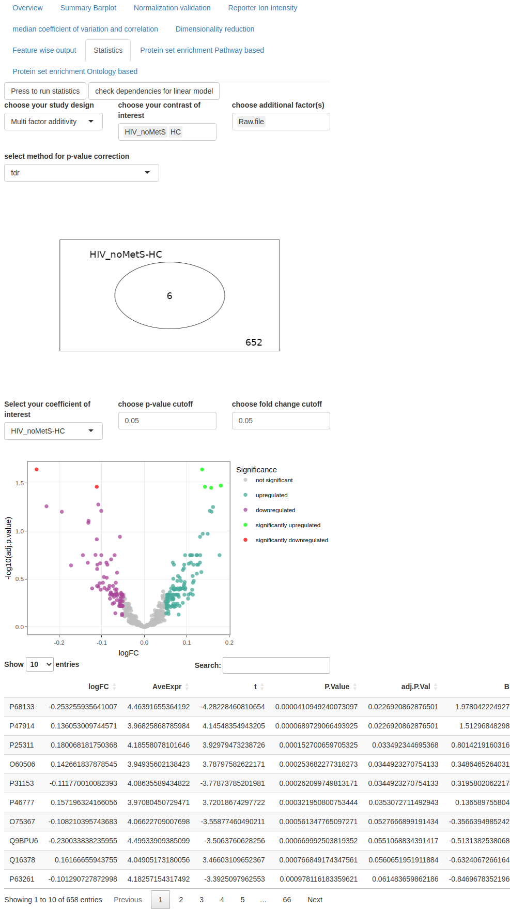

# Results

To begin using the application, the first step is to upload the tab-delimited evidence file and the sample annotation file. Once these files are uploaded, the application is ready to run with default values. The default settings are preconfigured for an initial analysis, and any further adjustments or fine-tuning can be made in subsequent steps of the analysis process.

```{r ui_summary, echo=F, out.width="100%", fig.align='center', fig.cap="Summary showing the process of the analysis pipeline"}

```

On the left side of the user interface, users can find the analysis pipeline settings that can be adjusted. Once the desired changes are made, they can be applied by clicking the update button. This allows users to observe the direct impact of the applied changes on the dataset.
In the summary visualization, it may appear cluttered due to the processing of 36 files. In smaller datasets, the nodes of the network graph can be more easily distinguished and understood.
When running the application with SCoPE2 \citep{Specht2021} reference cutoffs, the following results were visualized.

\newpage
```{r ui_numbers_default, echo=F, out.width="100%", fig.align='center', fig.cap="Barchart showing the number of peptide spectrum matches, peptides and proteins"}

```

The default settings of the analysis pipeline resulted in a total number of unique proteins below approximately $10^3$, which were aggregated from around $10^{3.5}$ peptides. Before these peptides were aggregated over approximately $10^{4.5}$ peptide spectrum matches. The aggregation method used is fixed by median.

\newpage
```{r ui_mutual_info_default, echo=F, out.width="100%", fig.align='center', fig.cap="Mutual information with default setting"}
knitr::include_graphics("screenshots/mutual_info_default.png")
```

After applying logarithmic transformation to the base 2 and performing column median row mean normalization, the mutual information (MI) within the healthy control (HC) group's sample type exhibits a reduction towards the lower edge of the interquartile range (IQR).

When comparing the MI between the HC group and the sample type corresponding to individuals with both HIV and metabolic syndrome, the IQR is further reduced and shifted towards the lower end compared to the MI values observed in the raw data.

\newpage
```{r ui_mutual_info_quant_norm, echo=F, out.width="100%", fig.align='center', fig.cap="Mutual information with quantile normalization"}

```

After performing a logarithmic transformation to the base 2 and quantile normalization, the mutual information (MI) within the healthy control (HC) group's sample type exhibits a minor reduction in the interquartile range (IQR). However, it should be noted that there is an increase in the number of outliers compared to the raw data.

When comparing the MI IQR of the HC group with the sample type corresponding to individuals with both HIV and metabolic syndrome, the reduction in MI falls within the interquartile range of the raw data MI. Additionally, the median remains close to unaffected, indicating that the overall central tendency of the MI values is relatively preserved.

\newpage
```{r ui_RI_channel_default, echo=F, out.width="100%", fig.align='center', fig.cap="Reporter ion intensity with selection on channel. The selected factor will be highlighted and indicated in the legend."}
knitr::include_graphics("screenshots/RI_channel_default.png")
```


When comparing the median reporter ion intensities across channels, no systematic bias is observed. However, it is worth noting that channel 7 exhibits a wide range of values spanning an order of magnitude. This comparison is crucial since the three sample types consistently occupy the same channels in every run, making the visualization an important aspect of the analysis. Despite the wide range of values in channel 7, there is still overlap in the interquartile ranges (IQR) across the majority of samples. 

\newpage
```{r ui_RI_file_default, echo=F, out.width="100%", fig.align='center', fig.cap="Reporter ion intensity with selection on file"}
knitr::include_graphics("screenshots/RI_file_default.png")
```

When comparing the median reporter ion intensities with a focus on the batch (=Raw.file), it becomes evident that there are significant changes in signal that need to be taken into account in further analysis. After applying quality control measures, several values have been lost due to cutoffs in parameters such as parental ion fraction (PIF), q-value, coefficient of variation, and missingness of peptide data.

For dimensionality reduction, the user has the option to choose the batch correction method ComBat \citep{Leek2012} in the side panel. However, this option is not set as the default choice. Instead, the conservative approach is followed, where the batch factor is included in the statistical module to account for any potential batch effects that may influence the results.

\newpage
```{r ui_RI_st_default, echo=F, out.width="100%", fig.align='center', fig.cap="Reporter ion intensity with selection on sampletype"}
knitr::include_graphics("screenshots/RI_st_default.png")
```

The sample type does not appear to have an impact on the median reporter ion intensities, as suggested by the overlapping interquartile ranges (IQRs). Nevertheless, the HIV group with metabolic syndrome displays a broader range of values spanning tenfold in arbitrary units.

\newpage
```{r ui_cv_st_default, echo=F, out.width="100%", fig.align='center', fig.cap="Median covariance of razor proteins with selection on sampletype"}
knitr::include_graphics("screenshots/cv_st_default.png")
```

A cutoff value of 0.65 for the coefficient of variation (CV) of razor proteins as shown in the SCoPE2 publication \citep{Specht2021} demonstrates a satisfactory fit to the data. The minimum number of observations determines the threshold for considering a razor protein ambiguous, based on the number of matching peptides. In this case, the reference publication set the threshold at 5 observations.

The interquartile ranges (IQRs) remained unchanged by this cutoff. The sample type did not influence the CV of razor proteins. Boxplots illustrate that the values are distributed similarly, as indicated by the overlapping IQRs.

\newpage
```{r ui_cv_rawfile_default, echo=F, out.width="100%", fig.align='center', fig.cap="Median coefficient of variation (CV) of leading razor proteins per cell with selection on Raw.file"}

```

The plot illustrates that certain batches (=raw files) exhibit a higher number of distinct matches compared to others, as indicated by a thin line depicting low density. Most interquartile ranges (IQRs) overlap, suggesting similarity among the majority of batches. However, specific batches display a lower IQR in median CV across razor protein peptides, indicating distinct matches.    

\newpage
```{r ui_cv_rawfile_nobs2, echo=F, out.width="100%", fig.align='center', fig.cap="Median coefficient of variation (CV) of leading razor proteins calculated for 2  observations per cell, with selection on Raw.file"}

```
By setting the number of observations to 2, the distributions become more equalized. Additionally, batches that initially exhibited a decreased coefficient of variation (CV) tend to inflate towards the threshold.

\newpage
```{r ui_cv_rawfile_nobs10, echo=F, out.width="100%", fig.align='center', fig.cap="Median coefficient of variation (CV) of leading razor proteins calculated for 10 observations per cell, with selection on Raw.file"}
knitr::include_graphics("screenshots/cv_rawfile_nobs10.png")
```

When the minimum number of observations for ambiguous peptides is set to 10, the distribution of medians across channels shows a decrease in density. This can be attributed to the rare occurrence of 10 unique peptides matching to the same protein, which is not commonly observed in the dataset. 

\newpage
```{r ui_heatmap, echo=F, out.width="100%", fig.align='center', fig.cap="Correlation heatmap"}

```
The heatmap reveals the Pearson pairwise correlation coefficients between all proteins. The dendrogram indicates that there are two main protein clusters, with one of the clusters showing further sub-clustering, indicating a strong relationship among the proteins in the sub groups. However, the other cluster, consisting of individual proteins, shows weaker correlations, leading to a more intricate branching pattern in the dendrogram.

\newpage
```{r ui_dim_red_default, echo=F, out.width="100%", fig.align='center', fig.cap="Dimensionality reduction analysis depicting sample types (indicated by shape) and raw files (indicated by color). Top: principle component analysis (PCA). Lower: Uniform Manifold Approximation and Projection (UMAP)"}

```

In both the Principal Component Analysis (PCA) plot and the Uniform Manifold Approximation and Projection (UMAP) plot, the second component is plotted against the first component. Surprisingly, neither visualization reveals any discernible clustering patterns based on sample type or batch. For the k-nearest neighbor descent algorithm (NN-descent) employed in the UMAP, first a default value of k=3 was selected.

\newpage
```{r ui_dim_red_changed_k, echo=F, out.width="100%", fig.align='center', fig.cap="Dimensionality reduction analysis showcasing sample types (represented by shape) and raw files (represented by color). Top: Principal Component Analysis (PCA). Bottom: Uniform Manifold Approximation and Projection (UMAP). For the UMAP visualization, the k value for the NN-descent algorithm was modified to 15."}

```

The second figure of the Principal Component Analysis (PCA) plot and the Uniform Manifold Approximation and Projection (UMAP), both displaying the second component against the first. Surprisingly, neither visualization reveals any discernible clustering patterns based on sample type or batch information. To enhance the resolution and capture more intricate patterns, the k-nearest neighbor descent algorithm (NN-descent) was adjusted, with a value of K set to 15. While the resulting plot exhibits improved detail, the underlying biological context or background remains elusive and does not emerge in the visual representation.

\newpage
```{r ui_dim_red_c3d, echo=F, out.width="100%", fig.align='center', fig.cap="3D visualization of dimensionality reduction analysis showcasing sample types (represented by shape) and raw files (represented by color). Top: Principal Component Analysis (PCA). Bottom: Uniform Manifold Approximation and Projection (UMAP)"}
knitr::include_graphics("screenshots/dim_red_3d.png")
```

In the 3D visualization, a subtle clustering pattern can be observed for the first two batches. Upon switching to the indicator sample type in the 3D visualization, no clustering can be observed whatsoever. This suggests that the variance in the dataset is not attributed to sample type or batch, reinforcing the notion that other factors could contribute to the observed variability. 

\newpage
```{r ui_dim_red_batchC, echo=F, out.width="100%", fig.align='center', fig.cap="Batch corrected dimensionality reduction analysis showcasing sample types (represented by shape) and raw files (represented by color). upper top: Principal Component Analysis (PCA). upper bottom: Uniform Manifold Approximation and Projection (UMAP). lower top: 3D Principal Component Analysis (PCA). lower bottom: 3D Uniform Manifold Approximation and Projection (UMAP)"}
knitr::include_graphics("screenshots/dim_red_batchC.png")

```

After applying batch correction using ComBat \citep{Leek2012}, neither the 2D nor the 3D visualization demonstrates any noticeable effects related to batches or sample types. The previously observed subtle clustering of the first two batches is now eliminated, indicating successful batch correction. However, it's important to note that the default pipeline was executed without batch correction for correct statistical testing. 

\newpage
```{r ui_feature, echo=F, out.width="100%", fig.align='center', fig.cap="Feature wise output for the protein P61313 (=60S ribosomal protein L15) over the course of the pipeline."}
knitr::include_graphics("screenshots/feature.png")
```

The scatter plots indicate the detected values associated with the protein UniProt ID P61313 (= 60S ribosomal protein L15). Starting from the peptide spectrum level and progressing to peptides aggregated for individual raw files, these plots offer a comprehensive view of the protein's peptide abundance across various batches. After merging the batches, the peptide appears to be abundant in all channels. Consequently, the need for missing value imputation with K-nearest neighbors (KNN) in this dataset becomes less likely, as missing values for the protein are uncommon once the batches are combined on the protein level.

\newpage
```{r ui_stat_dependency, echo=F, out.width="100%", fig.align='center', fig.cap="Popup window for checking the dependency of the statistic module"}
knitr::include_graphics("screenshots/stat_dependency.png")
```

The t-statistics employed in limma are known for their robustness in handling non-normally distributed values. Nonetheless, it is recommended for users to assess the distribution of their data based on sample types before proceeding with statistical analysis. If the user is not satisfied with the results or identifies any distributional issues, they can consider revisiting the transformation or normalization steps to address any concerns or improve the data distribution prior to statistical analysis.

In the example dataset, the expressi
on values for all sample types exhibit a unimodal distribution. However, when examining the quantile-quantile (qq) plot, heavy tails can be observed for all three groups. This indicates deviations from a perfectly normal distribution, suggesting potential outliers in the data.

\newpage
```{r ui_stat_HC_HIV_noMets, echo=F, out.width="90%", fig.align='center', fig.cap="Statistic module"}

```

By comparing the log10-transformed and quantile-normalized expression values between the HIV group without metabolic syndrome and the healthy control (HC) group, six differentially expressed proteins were identified. The Venndiagram indicates significantly up/downregulated proteins. The Volcano represents log10(adjusted p values) against log10 fold changes (logFC).
These proteins include P68133 (Actin, alpha skeletal muscle), P47914 (60S ribosomal protein L29), P25311 (Zinc-alpha-2-glycoprotein), O60506 (Heterogeneous nuclear ribonucleoprotein Q), P31153 (S-adenosylmethionine synthase isoform type-2), and P46777 (60S ribosomal protein L5). A total of 652 proteins have been identified as not significantly upregulated or downregulated in the comparison analysis. These proteins did not exhibit statistically significant differences in expression between the compared groups or conditions.

The direction of the contrast model determines the change in log-fold change (logFC) values. For instance, in the depicted figure, P68133 (Actin, alpha skeletal muscle) shows an increased expression of 0.25 (25%) in HIV_noMetS macrophages compared to HC macrophages. It's important to note that the logFC value changes by multiplication with -1 when the direction of the contrast model is reversed.

To account for potential batch effects, the batch factor was included as a cofactor in the model, ensuring that any observed differential expression is not confounded by batch variation.

\newpage
```{r ui_path_enrich_nw, echo=F, out.width="90%", fig.align='center', fig.cap="Pathway enrichment. Networkplot indicating the interaction of differentially expressed proteins"}
knitr::include_graphics("screenshots/path_enrich_nw.png")
```

The pathway enrichment mapped and tested with the exact Fisher test \citep{Sprent2011} the differentially expressed proteins P46777 (60S ribosomal protein L5) and P47914 (60S ribosomal protein L29) to the ribosome and coronavirus disease (COVID-19) nodes. 

\newpage
```{r ui_path_enrich_bar, echo=F, out.width="90%", fig.align='center', fig.cap="Pathway enrichment. Barplot indicating the interaction significance of differentially expressed proteins"}

```

The barplot shows the significance of the two nodes. The count indicates how many proteins are associated with the node of the network. When hovering over the bar the user can read the p-value of the performed Fisher test. The background for the statistical test can be chosen as genome wide (default) or as the detected proteins. When choosing the detected proteins as a background no protein could be considered as statistically significant. 


